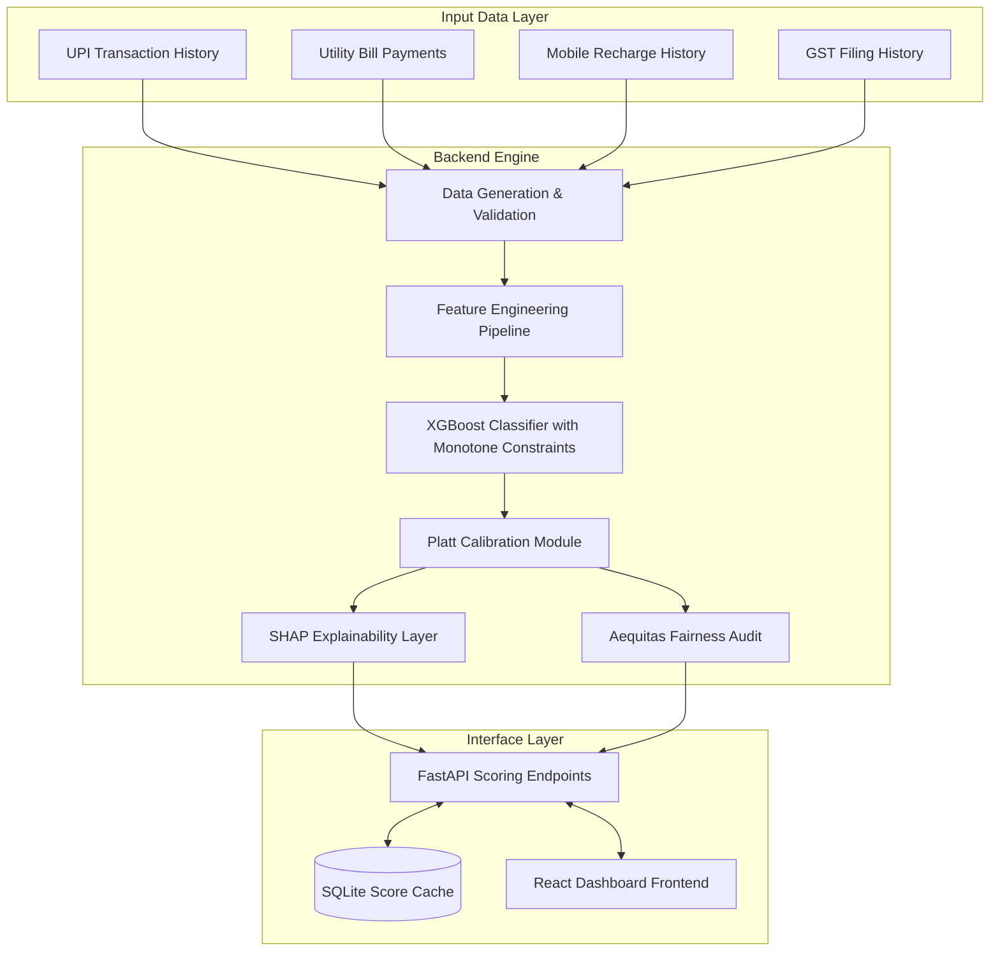

# CreditBridge

<p align="center">
  
</p>


An end-to-end alternative credit scoring system for financially active but credit-invisible individuals. By leveraging consent-driven alternative signals from the Reserve Bank of India (RBI) Account Aggregator (AA) framework—such as UPI transactional velocity, utility payments, mobile recharges, and GST filing data—CreditBridge engineers a calibrated alternative credit score (300 to 900 range) complete with plain-language SHAP explanations and demographic fairness audits.

---

## System Architecture



---

## Technical Features

### Monotonic XGBoost Classifier
Spurious feature relationships (such as a higher delinquency rate translating to a higher score) are prevented using strict monotone constraints. Monotone directionality is explicitly enforced:
- UPI transaction volume and payment streaks: positive constraint (+1)
- Failed transaction rates and service lapses: negative constraint (-1)

### Post-Training Calibration
Raw XGBoost output probabilities are calibrated using Platt scaling (via `CalibratedClassifierCV`) to ensure score probabilities correspond to actual default risk.

### Local Explainability (SHAP)
Individual inference runs generate SHAP contribution values via `TreeExplainer`. The top three SHAP vectors are compiled into plain-English reasons compliant with RBI guidelines on transparent lending.

### Fairness Auditing (Aequitas)
Automated evaluations of demographic parity, false positive rate (FPR) parity, and equal opportunity (TPR parity) are conducted across gender, geography tier, and income groups to ensure demographic bias remains below the 10% threshold.

---

## Score Classification

| Score Range | Category | Risk Profile |
|---|---|---|
| 750–900 | Prime | Very Low |
| 650–749 | Near-prime | Low |
| 550–649 | Subprime | Moderate |
| 400–549 | High Risk | High |
| 300–399 | Decline | Very High |

---

## Directory Structure

```
creditbridge/
├── backend/          # FastAPI REST API, training pipeline, and data generation
├── frontend/         # React + Vite dashboard web application
└── docs/             # Technical documentation and guides
```

---

## Quick Start

### Backend Service

1. Create a Python virtual environment at the repository root and activate it:
   ```powershell
   python -m venv .venv
   .venv\Scripts\activate
   pip install -r backend/requirements.txt
   ```

2. Run the machine learning pipeline from the `backend/` directory:
   ```powershell
   cd backend
   python data/synthetic/generate_profiles.py
   python -m src.features.build_features
   python -m src.model.train
   ```

3. Launch the FastAPI server:
   ```powershell
   uvicorn api.main:app --reload --port 8000
   ```
   The interactive Swagger documentation is available at `http://localhost:8000/docs`.

### Frontend Dashboard

1. Navigate to the `frontend/` directory and install dependencies:
   ```powershell
   cd frontend
   npm install
   ```

2. Start the Vite development server:
   ```powershell
   npm run dev
   ```
   The dashboard interface will be hosted at `http://localhost:5173`.

### Multi-Container Deployment

Start the backend and frontend services concurrently using Docker Compose:
```powershell
docker-compose up --build
```
- API Endpoint: `http://localhost:8000`
- Web Dashboard: `http://localhost:80`

---

## Project Documentation

Detailed reference documents are stored within the `docs/` folder:

| Document | Description |
|---|---|
| [System Overview](./docs/overview.md) | Comprehensive system architecture and RBI compliance standards |
| [Backend Guide](./docs/backend.md) | Backend modules, API layout, and configuration reference |
| [Frontend Guide](./docs/frontend.md) | Component architecture, neobrutalist design tokens, and API integration |
| [Model Reference](./docs/model.md) | Calibrated XGBoost details, SHAP formulas, and performance metrics |
| [Data Pipeline](./docs/data.md) | Synthetic data generation, Markov models, and feature extraction |
| [API Reference](./docs/api_reference.md) | Endpoint specifications, payload contracts, and error schemas |
| [Deployment Guide](./docs/deployment.md) | Multi-stage Docker setup, database integration, and environment files |

---

## Core Technologies

- **Machine Learning**: Python, XGBoost, scikit-learn, Imbalanced-learn (SMOTE), SHAP, Aequitas, MLflow
- **REST API**: FastAPI, Pydantic v2, SQLite, Uvicorn
- **Frontend**: React, Vite, Tailwind CSS, Recharts, Lucide React
- **DevOps & Testing**: Docker, Docker Compose, Pytest
